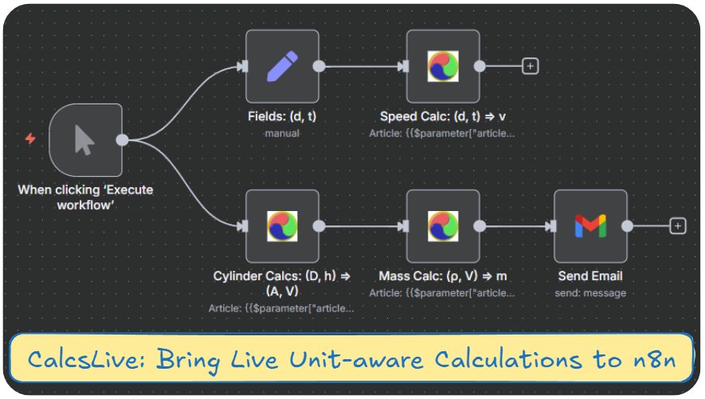

# n8n-nodes-calcslive

  

 **Plug-and-Play Unit-Aware Multi-Step Calculations to your n8n**
 
[CalcsLive](https://www.calcs.live) calculations feature unit-awareness and pure symbolic equations to enable you to THINK in Physics without distraction in handling units. [`@calcslive/n8n-nodes-calcslive`](https://www.npmjs.com/package/@calcslive/n8n-nodes-calcslive) brings in the power and elegance to your n8n ecosystem.  

Specifically for AI integration, it empowers AI agents with calculation accuracy and automatic handling of 540+ units across 64+ categories.

> **🚧 MVP Release**: This is our early release focused on core unit-aware calculation functionality. We're actively improving the node and welcome your feedback to help shape future features! [Share your thoughts](https://github.com/calcslive/n8n-nodes-calcslive/issues) or reach out at don.wen@calcs.live

## 🚀 Quick Start

### Installation
1. Open your n8n instance
2. Go to **Settings** → **Community Nodes** 
3. Enter `@calcslive/n8n-nodes-calcslive` and click **Install**
4. Create your **CalcsLive API** credentials with your API key for 'n8n Integration'

### First Calculation (5 minutes)
1. **Create a simple calculation** at [CalcsLive](https://www.calcs.live) and note the Article ID
2. Add the **CalcsLive Calculator** node to your workflow
3. Enter your Article ID and choose **Enhanced Mode** for guided setup
4. Add input values and watch the unit-aware magic happen! 🎯

**💡 Pro Tip**: Start with a simple unit conversion calc (see example below) to experience the power!

## 📸 Demo Workflow



*Example n8n workflow showing CalcsLive nodes performing unit-aware calculations: speed calculations, cylinder volume, and mass calculations with automatic unit handling.*

### 🎥 Video Demonstration

**[Watch the Complete Demo on YouTube →](https://www.youtube.com/watch?v=xC4iFwNkIQs)**
*"n8n + CalcsLive → Plug-and-Play Unit-Aware Calculations"*

This video walkthrough demonstrates:
- 🚀 Installation and setup in n8n
- 🎯 Creating CalcsLive calculations from scratch
- 🔗 Building unit-aware workflow integrations
- ⚡ Real-time calculation chaining between nodes
- 📊 Handling complex multi-step engineering calculations

### Supporting Calculations

The demo workflow uses these CalcsLive calculations:

| Calculation | Preview | Description |
|-------------|---------|-------------|
| **Speed & <br>Cylinder Calculators <br> [(Link)](https://www.calcs.live/editor/3M6UW7CQB-2AP)** |  | Distance/time → speed;<br> Cylinder base diameter, height → Volume & Mass; <br> Unit Conversions <br> (All with unit conversion) |
| **Mass Calculator<br> [(Link)](https://www.calcs.live/editor/3M6VLSBHB-3HT)** |  | Volume+Density → Mass calculation |

### 🧩 Why Separate Calculations? The Composability Advantage

**Question**: Why create a separate mass calculator when the first calculation already includes mass calculation?

**Answer**: This demonstrates CalcsLive's **composable architecture** - a key design principle that unlocks powerful workflow patterns:

🔗 **Calculation Chaining**: 
- Calc1 outputs volume → Calc2 uses that volume as input
- n8n expressions seamlessly bridge: `{{$json.volume_result}}`

♻️ **Reusability at Scale**:
- One mass calc works with ANY volume calculation
- Cylinder volume + Mass calc = Cylinder mass
- Box volume + Mass calc = Box mass  
- Sphere volume + Mass calc = Sphere mass

🎯 **Result**: Instead of creating separate mass calculations for every shape, you build **modular, reusable calculation components** that combine in endless ways. This is the power of composable engineering in n8n workflows!

### 📥 Import Ready-to-Use Template

Want to try this workflow instantly? Download and import our template:

**[📥 Download Demo Workflow](assets/calcslive-demo-workflow-template.json)** *(Right-click → Save As)*

**Import Instructions:**
1. In n8n: **Workflows** → **Import from File**  
2. Upload `calcslive-demo-workflow-template.json`
3. **Set up credentials** (you'll be prompted):
   - **CalcsLive API**: Add your API key from [CalcsLive Account](https://www.calcs.live/account)
   - **Gmail** (optional): Configure for email notifications
4. **Execute** and watch the unit-aware magic! ✨

The template includes data chaining expressions showing how volume flows from Cylinder calc → Mass calc seamlessly.

## ✨ Why CalcsLive? The Plug-and-Play Revolution!

### **🔌 Plug-and-Play Power**
CalcsLive transforms n8n workflows with **zero-configuration unit awareness**. Simply plug the CalcsLive node between any two nodes and instantly bridge different unit systems, calculations, or data formats.

### **🚀 n8n Expressions + Unit Awareness = Game Changer**
When you use n8n expressions (`{{$json.data}}`) with CalcsLive, your workflow data becomes **unit-aware**:
- **Dynamic Values**: `{{$json.temperature}}` → Automatic °C to °F conversion
- **Smart Bridging**: Any node → CalcsLive → Any node with proper units  
- **Zero Code**: No manual conversion formulas or complex calculations needed

### **Before vs After Comparison**
```javascript
// ❌ Before: Manual unit conversion nightmare
const distanceKm = 150;
const timeHours = 2;  
const speedKmH = distanceKm / timeHours; // = 75 km/h
// Need mph? Write more conversion code...
const speedMph = speedKmH * 0.621371; // = 46.6 mph
```

```json
// ✅ With CalcsLive: Plug-and-play unit-aware workflows
{
  "inputs": {
    "D": { "value": "{{$json.distance}}", "unit": "km" },
    "t": { "value": "{{$json.time}}", "unit": "h" }
  },
  "outputs": {
    "s": { "unit": "mph" }
  }
}
// Result: Perfect unit conversion with n8n expression data! 🎯
```

## 🎯 Real-World Use Cases

### **🔌 Plug-and-Play Benefits for n8n Ecosystem**

**🎯 Instant Unit Bridging**: Drop CalcsLive between any nodes to bridge unit mismatches
- Google Sheets (metric) → CalcsLive → US Database (imperial) ✨
- IoT Sensors (various units) → CalcsLive → Normalized Dashboard 📊
- API Response (°C) → CalcsLive → Email Alert (°F) 📧

**🚀 Zero Configuration**: No complex setup, just plug and play
- Create calc once → Use everywhere in your workflows
- n8n expressions work seamlessly with unit awareness
- Dynamic data flows get automatic unit intelligence

**⚡ Workflow Superpowers**: Transform ordinary workflows into unit-aware automation
- **Before**: 5 nodes + custom code for unit conversion
- **After**: 1 CalcsLive node with automatic unit handling
- **Result**: Cleaner workflows, fewer errors, more reliability

## 🔧 Configuration Modes

### **Enhanced Mode** (Recommended) 🌟
User-friendly interface with:
- **Dropdown Selectors**: Choose input/output quantities from article
- **Auto-Discovery**: Automatically loads available parameters
- **Default Values**: Pre-populated with article defaults
- **Unit Validation**: Visual feedback for valid units
- **Smart Tooltips**: Contextual help for each parameter

### **Legacy Mode** (Advanced Users)
Direct JSON input for:
- **Power Users**: Full control over request structure  
- **Custom Integrations**: Programmatic parameter generation
- **Dynamic Workflows**: Expression-based parameter building

## 📋 Step-by-Step Guide

### **Step 1: Get Your API Key**
1. Visit [CalcsLive](https://www.calcs.live) and create an account
2. Go to **Account** → **API Keys** 
3. Generate a new API key for n8n integration
4. Note your subscription tier limits (Free: 100 calls/month after trial)

> **📦 npm Package**: [`@calcslive/n8n-nodes-calcslive`](https://www.npmjs.com/package/@calcslive/n8n-nodes-calcslive)

### **Step 2: Configure Credentials**
1. In n8n: **Credentials** → **Create New** → **CalcsLive API**
2. Enter your API key from Step 1
3. Base URL: `https://www.calcs.live` (default)

### **Step 3: Create Your Calculation Articles**
**Security Note**: CalcsLive's n8n integration API is designed so users can only use their own public calculation articles in the CalcsLive node. You can create your own articles and use them in your node easily following the examples.

1. Visit [CalcsLive](https://www.calcs.live) and create your calculation
2. Define your Physical Quantities (PQs) and mathematical relationships  
3. Save your calculation and **find the Article ID in the URL**
   - Example URL: `https://www.calcs.live/editor/3M5NVUCGW-3TA`
   - Article ID: `3M5NVUCGW-3TA` (the part after `/editor/`)

**Demo Article IDs** (for reference only - create your own for actual use):
- `3M5NVUCGW-3TA` - Speed Distance Time Calculator (demo)
- `3VQ7Z8X2P-4B9` - Power Calculation (demo)
- `2H8M3K5N-7C1` - Material Stress Analysis (demo)

### **Step 4: Configure Your Node**

#### **Enhanced Mode Setup:**
1. **Article ID**: Enter your chosen calculation ID
2. **Input Physical Quantities**: Click "Add Input PQ"
   - Select parameter from dropdown
   - Enter value (or use expression)
   - Specify unit (optional - uses article default)
3. **Output Physical Quantities**: Click "Add Output PQ" 
   - Select desired output parameter
   - Specify preferred unit for results

#### **Legacy Mode Setup:**
```json
{
  "articleId": "3M5NVUCGW-3TA",
  "inputs": {
    "D": { "value": 150, "unit": "km" },
    "t": { "value": 2, "unit": "h" }
  },
  "outputs": {
    "s": { "unit": "mph" }
  }
}
```

#### **Note**
For input PQs and output PQs in your article, when they are not used in your node, input values and units in the article will be used to perform the calculations for your node.

It is recommended to include all input and out PQs available from the article in your node, to allow flexibility in use for both upstream and downstream nodes.

## 💡 Workflow Examples

### **Example 1: Simple Unit Conversion (Perfect for Getting Started!)**
**Step 1**: Create a calc in CalcsLive frontend with 2 PQs:
- `PQ0 = 2 m` (input quantity) 
- `PQ1 = PQ0 cm` (output - just unit conversion)

**Step 2**: Use in n8n workflow as a plug-and-play unit converter:
```
Data Source → CalcsLive Calculator → Next Node
```
```json
{
  "articleId": "YOUR-ARTICLE-ID",
  "inputs": {
    "PQ0": { "value": "{{$json.length_meters}}", "unit": "m" }
  },
  "outputs": {
    "PQ1": { "unit": "cm" }
  }
}
```
**🎯 Result**: Automatic m → cm conversion! Refer to [Interactive Units Database](https://www.calcs.live/help/units-reference#interactive-units-database) for all units and categories CalcsLive support. The CalcsLive node becomes a **unit-aware bridge** between any two nodes in your workflow.

### **Example 2: IoT Sensor Processing with n8n Expressions**
```
IoT Sensor → CalcsLive Calculator → Database
```
**🚀 Game-Changer**: When you use n8n expressions (like `{{$json.temperature}}`) with CalcsLive, your data gets **unit-awareness superpowers**!
```json
{
  "inputs": {
    "temp_c": { "value": "{{$json.temperature}}", "unit": "°C" }
  },
  "outputs": {
    "temp_f": { "unit": "°F" }
  }
}
```

### **Example 3: Batch Spreadsheet Processing**
```
Google Sheets → CalcsLive Calculator → Email Report
```
**Use Case**: Process engineering data with n8n expressions passing spreadsheet values directly to unit-aware calculations

### **Example 4: Real-time Monitoring Dashboard**
```
Webhook → CalcsLive Calculator → InfluxDB → Grafana
```
**Use Case**: Monitor manufacturing equipment with unit-normalized metrics using dynamic n8n expressions

### **Example 5: Compliance Reporting**
```
Database Query → CalcsLive Calculator → PDF Generator → Email
```
**Use Case**: Generate regulatory reports with region-appropriate units

## 📊 Understanding Node Output

### **Success Response Structure**
```json
{
  "success": true,
  "articleId": "3M5NVUCGW-3TA",
  "inputs": {
    "D": {
      "symbol": "D",
      "value": 150,
      "unit": "km", 
      "baseValue": 150000,
      "baseUnit": "m",
      "description": "Distance"
    }
  },
  "outputs": {
    "s": {
      "symbol": "s",
      "value": 46.6,
      "unit": "mph",
      "baseValue": 20.83,
      "baseUnit": "m/s", 
      "expression": "D/t",
      "description": "Speed"
    }
  },
  "_metadata": {
    "executionTime": "2025-09-03T17:30:00.000Z",
    "processingTimeMs": 45
  }
}
```

### **Key Output Fields**
- **`value`** & **`unit`**: Your requested result with specified units
- **`expression`**: Mathematical formula used for calculation
- **`description`**: Human-readable parameter description

## 🚨 Error Handling & Troubleshooting

### **Common Error Messages**

| Error Code | Message | Solution |
|------------|---------|----------|
| **401** | Invalid API Key | Check your CalcsLive API credentials |
| **404** | Article Not Found | Verify article ID exists and is public |
| **400** | Invalid Input Format | Check JSON structure and unit syntax |
| **429** | Rate Limit Exceeded | Wait or upgrade subscription tier |
| **500** | Server Error | Temporary CalcsLive service issue |

### **Best Practices**
- **Cache Article Metadata**: Use Set nodes to avoid repeated validation calls  
- **Error Boundaries**: Add error handling for calculation failures
- **Unit Validation**: Test unit compatibility before production deployment
- **Rate Limiting**: Monitor API usage in high-frequency workflows

### **Debugging Tips**
1. **Enable Node Debugging**: Check console logs for detailed request/response info
2. **Test Articles**: Use demo article IDs for initial testing
3. **Unit Checking**: Verify unit spelling - case sensitive! (`km` not `KM`)
4. **Expression Validation**: Check that symbols match article definitions

## 🔧 Advanced Configuration

### **Dynamic Parameters with Expressions**
```json
{
  "inputs": {
    "pressure": { 
      "value": "{{$json.sensor_pressure}}", 
      "unit": "{{$json.sensor_unit || 'Pa'}}" 
    }
  }
}
```

### **Conditional Output Units**
```json
{
  "outputs": {
    "temperature": { 
      "unit": "{{$json.region === 'US' ? '°F' : '°C'}}" 
    }
  }
}
```

### **Batch Processing Pattern**
```javascript
// Split incoming array → CalcsLive Calculator → Merge results
```

## 🌍 Units & Categories

CalcsLive supports **64+ unit categories** with **540+ units**! 

📖 **Complete Reference**: Visit [CalcsLive Units Reference](https://www.calcs.live/help/units-reference) for the interactive browser with search functionality and complete unit listings.

## 📚 API Reference

### **Node Parameters**

| Parameter | Type | Required | Description |
|-----------|------|----------|-------------|
| `articleId` | string | ✅ | CalcsLive calculation article identifier |
| `configMode` | enum | ✅ | "enhanced" or "legacy" configuration mode |
| `inputPQs` | array | 📋 | Enhanced mode: Physical quantity inputs |
| `outputPQs` | array | ⚪ | Enhanced mode: Desired outputs with units |
| `inputs` | JSON | 📋 | Legacy mode: Direct JSON input structure |  
| `outputs` | JSON | ⚪ | Legacy mode: Direct JSON output specification |

**Legend**: ✅ Required, 📋 Required in respective mode, ⚪ Optional

### **Input PQ Structure (Enhanced Mode)**
```json
{
  "symbol": "D",          // Parameter symbol from article
  "value": 150,           // Numeric value
  "unit": "km"            // Unit specification (optional)
}
```

### **Output PQ Structure (Enhanced Mode)**
```json
{
  "symbol": "s",          // Output parameter symbol  
  "unit": "mph"           // Desired output unit
}
```

## 🔗 Integration Examples

### **Google Sheets Integration**
```
Google Sheets Trigger → CalcsLive Calculator → Google Sheets Update
```
Process engineering data with automatic unit normalization.

### **Discord/Slack Bot**
```
Discord Trigger → CalcsLive Calculator → Discord Response
```
Create calculation bots for engineering teams.

### **Database ETL Pipeline** 
```
Database → CalcsLive Calculator → Transform → Data Warehouse
```
Standardize units across diverse data sources.

### **Monitoring & Alerting**
```
Sensor API → CalcsLive Calculator → Condition → Email Alert
```
Calculate safety thresholds with proper unit handling.

## 🆘 Support & Community

- **📖 Documentation**: [CalcsLive Docs](https://www.calcs.live/docs)
- **🔧 API Reference**: [CalcsLive API Docs](https://www.calcs.live/docs/api) 
- **🐛 Bug Reports**: [GitHub Issues](https://github.com/calcslive/n8n-nodes-calcslive/issues)
- **💬 Community**: [n8n Community Forum](https://community.n8n.io)
- **📧 Direct Support**: don.wen@calcs.live

## 🤝 Contributing

We welcome contributions! Here's how to get involved:

1. **Fork** the repository
2. **Create** a feature branch (`git checkout -b feature/amazing-feature`)
3. **Commit** your changes (`git commit -m 'Add amazing feature'`)
4. **Push** to the branch (`git push origin feature/amazing-feature`)
5. **Open** a Pull Request

### **Development Setup**
```bash
git clone https://github.com/calcslive/n8n-nodes-calcslive.git
cd n8n-nodes-calcslive
npm install
npm run build
npm link

# In your n8n directory
npm link n8n-nodes-calcslive
n8n start
```

## 📋 Version History

### **0.1.0** - MVP Release
- ✅ Enhanced and Legacy configuration modes
- ✅ Automatic unit conversion system  
- ✅ Comprehensive error handling
- ✅ API key authentication
- ✅ Input/output parameter discovery
- ✅ Debug logging for troubleshooting

### **Roadmap**
- **0.2.0**: Batch processing optimizations
- **0.3.0**: Cached metadata for improved performance  
- **0.4.0**: Visual calculation builder interface
- **1.0.0**: Production release with full test coverage

## 📜 License

MIT License - see [LICENSE](LICENSE) file for details.

## 🌟 About CalcsLive

CalcsLive transforms how engineers and technical professionals handle calculations by embedding unit-aware mathematics directly into documents and workflows. Founded on the principle that calculations should be as easy as writing text, CalcsLive bridges the gap between mathematical rigor and practical usability.

**Visit [CalcsLive](https://www.calcs.live) to explore the full platform!**

---

*Made with ❤️ by the CalcsLive team. Empowering engineers through intelligent calculations.*